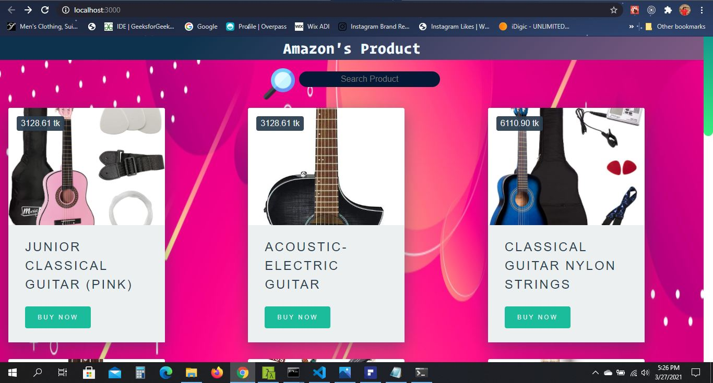
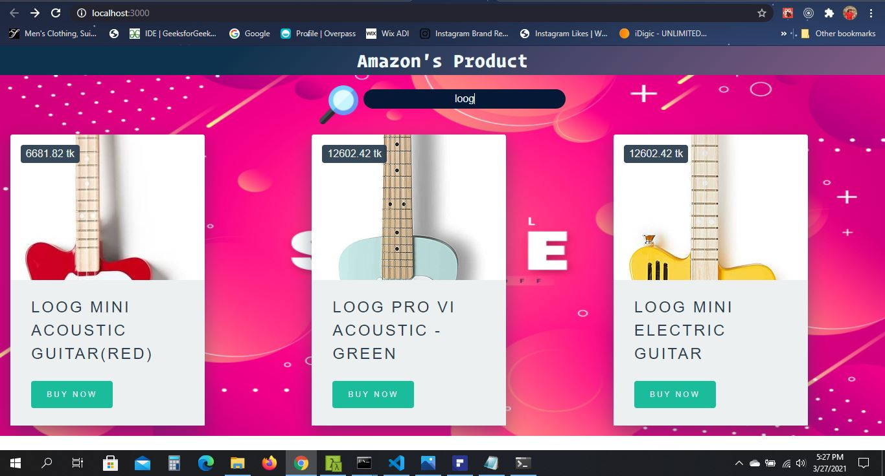

# Simple E-Commerse Site

> ## Running Procedure :
> ### i) After downloading the project go inside the project & run the command `npm install`,this installs all the required packages
>  ### ii) then enter the command `npm start` after that `React App` will run on `port 3000` 
>  ### iii) Now the app will be visible in `http://localhost:3000/`
> ## Home Page View : 
>    
> ##  After Searching Home Page View will look like: 
>  
